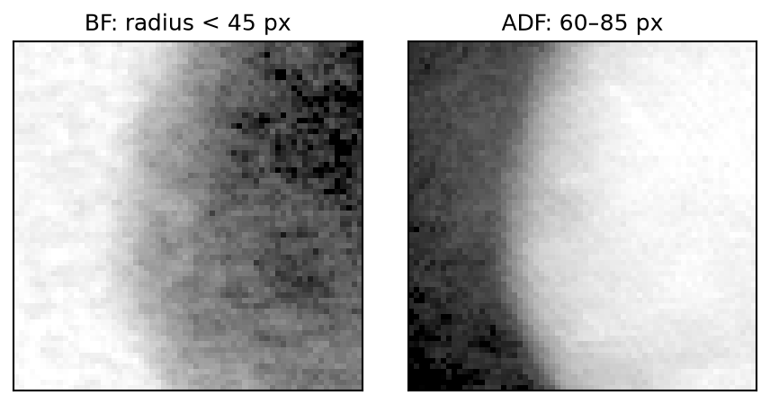
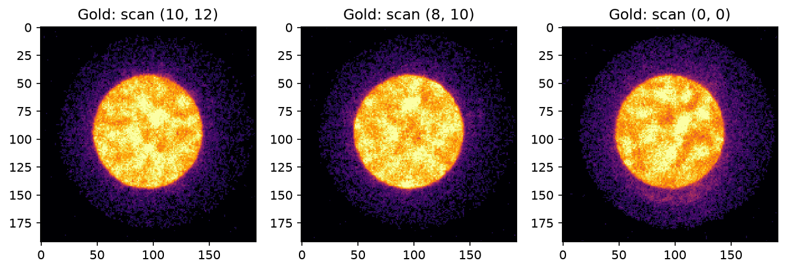
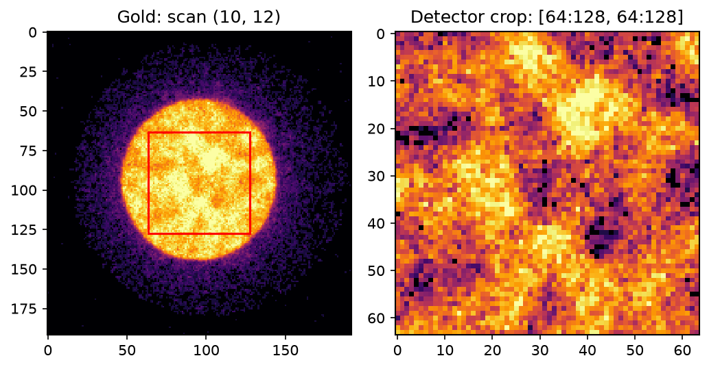

# quantem.gpu

GPU-accelerated 4D-STEM analysis in Python: load acquisitions, explore
virtual detectors, calculate CoM/DPC, and reconstruct phase with
single-sideband ptychography (SSB). Use NVIDIA CUDA on Linux or Python MPS
on Apple Silicon.

[Documentation](https://bobleesj.github.io/quantem.gpu/) ·
[API guide](docs/api/io.md) · [Contributing](CONTRIBUTING.md) ·
[Issues](https://github.com/bobleesj/quantem.gpu/issues)

[Install](#install) · [Load and inspect](#load-diffraction-patterns) ·
[BF/ADF](#bright-field-and-annular-dark-field-images) ·
[Save as QEM](#why-qem-one-research-format-across-detector-vendors) ·
[SSB](#reconstruct-phase-with-ssb)

## Install

Python 3.11 or newer is required. For the current ANS loading and SSB workflows,
install from source:

**NVIDIA GPU — CUDA (Linux)**

```bash
git clone https://github.com/bobleesj/quantem.gpu.git
cd quantem.gpu
python -m pip install -e ".[cuda]"
```

**Apple Silicon Mac — MPS/Metal**

```bash
git clone https://github.com/bobleesj/quantem.gpu.git
cd quantem.gpu
python -m pip install -e ".[mps]"
```

The Mac SSB backend uses MLX and Metal. Array indexing uses
PyTorch; install a GPU-enabled PyTorch build to use those examples.
For DM3/DM4 files, add the `dm` extra: `".[cuda,dm]"` or `".[mps,dm]"`.
Record `git rev-parse HEAD` with your results to reproduce the exact version.

This is pre-release software. The older TestPyPI candidate
`quantem.gpu==0.0.1rc8` does not include all current source features.
See [installation and runtime checks](docs/install.md) for details.

## Load diffraction patterns

These examples use a gold acquisition: a 512 × 512 scan with a 192 × 192
detector. Replace `gold_master.h5` with your file and keep its companion HDF5
files beside it. Install `quantem` for `show_2d` and GPU-enabled PyTorch for
indexing. The data are not bundled here.

### Load and inspect

```python
from quantem.gpu import io, detector
from quantem.core.visualization import show_2d

data = io.load("gold_master.h5")
show_2d(data[10, 12], norm="power_sqrt")  # pattern at scan position (10, 12)
```

Indexing decodes the selection into a GPU tensor; `show_2d` handles it directly.
The acquisition remains ANS encoded. Backend selection uses CUDA or MPS and
never silently falls back to CPU.

```python
data.shape     # (512, 512, 192, 192): scan axes, then detector axes
data.dtype     # measurement dtype
data.metadata  # calibration, units, source and recorded corrections
```

The gold source flags four detector pixels; loading applies median hot-pixel
correction by default. Use `hot_pixel_correction="none"` in `io.load` to retain
the original measurements.

### Bright-field and annular dark-field images

```python
bf = detector.bf(data)
adf = detector.adf(data)
show_2d([bf, adf], title=["BF", "ADF"], norm="power_sqrt")
```



| Image | Detector region summed at each scan position |
|---|---|
| BF | Disk through the fitted radius |
| ADF | Ring from one to two fitted radii, within the detector |

These are full-scan images. The acquisition stays ANS encoded; the reduced
images are NumPy arrays. Each panel uses its own square-root display contrast.
The first detector call fits the bright-field disk automatically. Later BF,
ADF and DF calls reuse that fit for the same encoded acquisition. Mutable
array inputs are fitted again on each call.

Choose a different ADF ring by specifying its inner and outer radii:

```python
adf = detector.adf(
    data, inner=60, outer=85, unit="px",
)
show_2d(adf, norm="power_sqrt")
```

Use `unit="mrad"` for collection angles when convergence semi-angle calibration
is available in `data.metadata`.

### Override or inspect the disk geometry

Override only what you need; the other value is fitted automatically:

```python
bf = detector.bf(data, radius=45)  # radius in detector pixels
bf = detector.bf(data, center=(94, 96))  # (row, column)
```

Overrides affect only that call. Later calls without overrides keep using
the automatic fit. For dark field outside the fitted disk:

```python
df = detector.df(data)
show_2d(df, norm="power_sqrt")
```

To inspect the mean diffraction pattern and fitted values explicitly:

```python
mean_dp = detector.mean(data)
center, radius = detector.fit_probe(mean_dp)
show_2d(mean_dp, norm="power_sqrt")
```

`fit_probe` estimates the bright-field disk geometry, not probe phase or
aberrations. It is optional for BF, ADF and DF images.

### Select patterns and detector pixels

Indexing follows this order everywhere:

```text
data[scan_row, scan_column, detector_row, detector_column]
```

| Selection | Meaning |
|---|---|
| `data[10, 12]` | One full diffraction pattern |
| `data[8:12, 10:16]` | A 4 × 6 scan patch, with the full detector |
| `data[:, :, 95, 100]` | One detector pixel across every scan position |
| `data[10, 12, 64:128, 64:128]` | A detector crop at one scan position |
| `data[8:12, 10:16, 64:128, 64:128]` | The same detector crop at 24 positions |

Display several patterns directly:

```python
show_2d([data[10, 12], data[8, 10], data[0, 0]], norm="power_sqrt")
```



Display a scan image from one detector pixel:

```python
show_2d(data[:, :, 95, 100], norm="power_sqrt")
```

Or inspect a crop within one pattern:

```python
show_2d(data[10, 12, 64:128, 64:128], norm="power_sqrt")
```



The red box marks the crop. Crop coordinates start at zero locally; add 64
to recover original detector coordinates. The saved figure uses independent
square-root contrast per panel. Selection does not bin or interpolate pixels.

Indices start at zero; slice stops are excluded. Integers, slices and ellipsis
work, including negative indices and steps. Index arrays and boolean masks
are not yet supported. `data[:]` requests the entire decoded acquisition;
select a smaller region to limit memory. Strided slices decode their bounding
region before selecting values. CUDA streamed integer ANS data decode only the
selected detector streams; other storage profiles may decode whole frames.

Keep `data` open while reading it or using a viewer that depends on it:

```python
data.close()  # when finished with this acquisition
```

### One acquisition from a 5D-STEM series

A series adds an acquisition axis: tilt, time or repeat. If acquisitions are
separate files, load the one you want:

```python
paths = ["tilt_00.qem", "tilt_01.qem", "tilt_02.qem"]
with io.load(paths[1]) as acquisition:
    show_2d(acquisition[10, 12], norm="power_sqrt")  # second acquisition
```

Or keep several acquisitions open without building a dense 5D stack:

```python
series = io.load(paths, stack=False)
show_2d(series[1][10, 12], norm="power_sqrt")  # second acquisition, one pattern
```

`series[1]` selects an acquisition; the following `[10, 12]` selects a scan
position. Close the series members after their last use:

```python
for acquisition in series:
    acquisition.close()
```

For separate 4D datasets inside an EMD file, select the stored dataset path:

```python
with io.load("experiment.emd", dataset_path="experiment/acquisition/data") as data:
    show_2d(data[0, 0], norm="power_sqrt")
```

These examples select files or named datasets, not an arbitrary axis in any
on-disk 5D tensor. See [supported container layouts](docs/api/io.md).

## Why QEM? One research format across detector vendors

Different microscopes and detectors write different file layouts, metadata
names, and units. Researchers should be able to load an acquisition and analyze
it without rewriting those conventions for every instrument. **QEM is our open,
research-oriented format for keeping diffraction measurements and their
scientific meaning together.** We recommend it for reusable QuantEM datasets.
It is an evolving format, not an established industry standard.

### What does a `.qem` file contain?

| Content | Why it matters |
|---|---|
| Encoded diffraction measurements, shape and dtype | Retain the data without storing a full uncompressed cube |
| Named scan and detector axes | Make `(row, column)` ordering explicit |
| Calibration values with units and provenance | Interpret distances, angles and microscope settings consistently |
| Reader-retained source metadata | Keep the original instrument context alongside normalized fields |
| Recorded corrections and precision choices | Know what happened before analysis |
| Format/codec versions, indexes and integrity checks | Locate, decode and validate the saved measurements |

Available calibration is expressed in microscopy units: scan sampling in Å,
detector sampling in mrad or Å⁻¹, accelerating voltage in kV, convergence
semiangle in mrad, and dwell time in µs. Angular and reciprocal sampling are
different quantities; the format preserves that distinction. Missing values
remain unknown. Importers retain supported source metadata, not necessarily
every proprietary field.

QEM uses a versioned binary container with a JSON metadata header and encoded
payloads. ANS compression supports compact storage and selected-pattern decoding.
The file is **not HDF5**; use the QEM reader. The
[container specification](docs/api/qem-format.md),
[codec definitions](docs/api/qem-codecs.md), and
[Python format guide](docs/api/qem-python.md) document how it is written and read.

### Import, export, and reopen

```python
from quantem.gpu import io

with io.load("gold_master.h5") as data:
    io.save("gold.qem", data)

data = io.load("gold.qem")
show_2d(data[10, 12], norm="power_sqrt")
data.metadata
```

Save once, then use the same indexing workflow when reopening. The saved file
contains its encoded measurements; decoding does not require the original
vendor files. Keep those originals as the acquisition archive. Saving preserves
the loaded measurements and their recorded processing: compression does not
undo hot-pixel corrections or an explicitly requested lossy precision change.
An existing destination is not overwritten.

```python
data.close()
```

## Reconstruct phase with SSB

Supply the microscope calibration and fit defocus and astigmatism:

```python
from quantem.gpu import SSB

with SSB.open(
    "acquisition.qem",
    voltage_kV=300,
    semiangle_mrad=30,
    scan_sampling_A=0.264,
) as workflow:
    result = workflow.fit(save_to="results/ssb")
    phase = result.phase
```

The calibration values above are examples; use your acquisition's values.
`phase` is in radians. Use `reconstruct()` for known aberrations, or `preview()`
for interactive parameter changes. The [SSB guide](docs/api/ssb.md) covers
fitting, tilt correction, saved results, and finer CUDA preview sampling.

## What can I do?

| Workflow | Guide |
|---|---|
| Load, inspect, and save acquisitions | [I/O](docs/api/io.md) |
| BF, DF, ADF and other virtual detectors | [Detector reductions](docs/kernels/virtual-detectors.md) |
| CoM, DPC and integrated DPC | [CoM/DPC](docs/kernels/com-dpc-idpc.md) |
| Phase reconstruction and aberration fitting | [SSB](docs/api/ssb.md) |
| Run CUDA computation remotely | [Remote compute](docs/remote/index.md) |

Arrays use `I[R_r,R_c,k_r,k_c]`: scan row, scan column, detector row,
detector column. Coordinates are `(row, column)`. Supported operations differ
between runtimes; see the [Implementation overview](docs/dashboard.md) and
[verified performance](docs/performance/results.md) for measured coverage.

Backend implementation details, including native and browser integrations,
belong in the [developer documentation](docs/developer/index.md).

## Citing quantem.gpu

If the quantEM interactive framework contributed to your research, please
consider citing:

> Sangjoon Lee et al., “Interactive Framework for Real-Time 4DSTEM Analysis
> and Reconstruction,” *Microscopy and Microanalysis* 32 (Supplement 1),
> ozag053.941 (2026). https://doi.org/10.1093/mam/ozag053.941

[MIT License](LICENSE).
