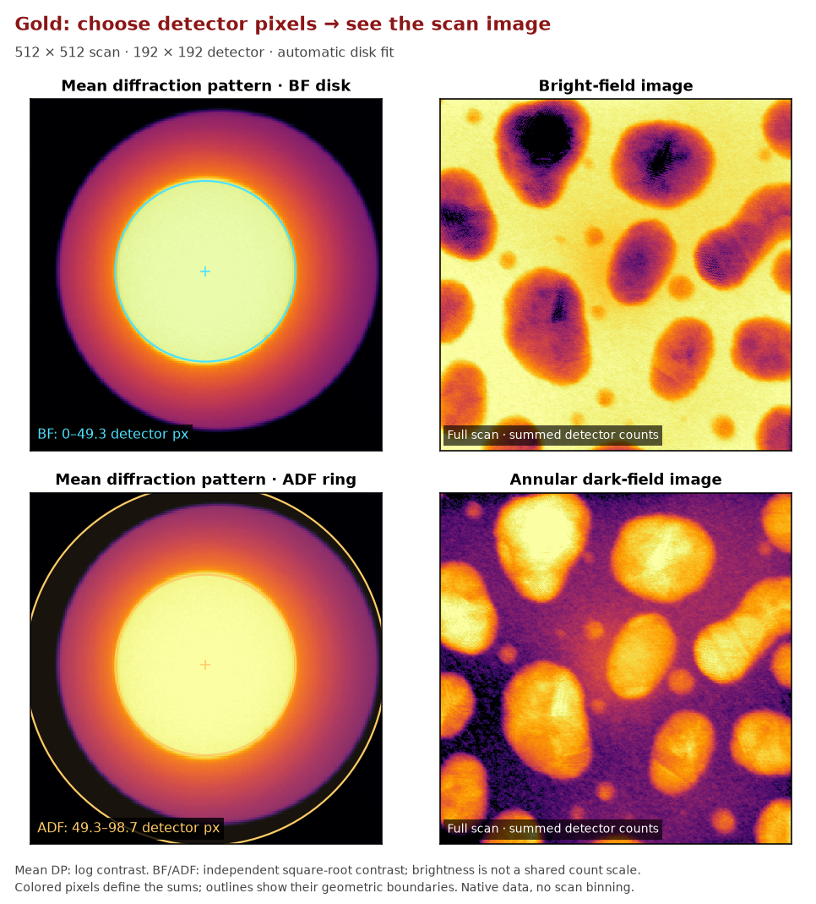

# Detector and DPC API

The detector and DPC namespaces own reusable reductions from
$I[R_r,R_c,k_r,k_c]$ to detector-shaped or scan-shaped scientific products.
They return numerical arrays; use `show_2d` for a static figure or a viewer for
interactive exploration.

## Start with automatic disk fitting

```python
from quantem.gpu import detector, io
from quantem.core.visualization import show_2d

data = io.load("gold_master.h5")
bf = detector.bf(data)
adf = detector.adf(data)
show_2d([bf, adf], title=["BF", "ADF"], norm="power_sqrt", cmap="inferno")
```

The first BF/ADF/DF call estimates the disk center and radius from the mean
diffraction pattern. Calls on the same encoded acquisition reuse that geometry.
Mutable array inputs are fitted again. No `prepare` or manual fit is needed.

| Image | Default detector selection |
| --- | --- |
| `detector.bf(data)` | From the center through one fitted radius |
| `detector.adf(data)` | Between one and two fitted radii |
| `detector.df(data)` | Outside one fitted radius |

Selections stop at the detector boundary. These are sums, not averages.
Keep `data` open until calculations and viewers finish, then call `data.close()`.



The left panels use shared log contrast. BF and ADF use independent square-root
contrast; their displayed brightness is not a shared count scale. See the
[README plotting workflow](https://github.com/bobleesj/quantem.gpu/blob/main/README.md#preview-the-detector-selection) to
draw the same selection outlines. Pass `cmap="inferno"` to choose that colormap.

## Override the detector selection

```python
bf = detector.bf(data, radius=45)  # radius in detector pixels
adf = detector.adf(data, inner=60, outer=85, unit="px")
df = detector.df(data, inner=60, unit="px")
adf = detector.adf(data, inner=60, outer=85, unit="px", center=(96, 96))
```

Supply only the values you know. Missing geometry is fitted automatically;
overrides apply to that call and do not replace the cached automatic fit.
`radius` always means the bright-field disk radius in pixels. In ADF, it sets
the default one-to-two-radius band; use `inner` and `outer` for explicit limits.
Explicit ADF/DF limits default to milliradians, so include `unit="px"` for pixels.

## Inputs and outputs

| Call | Input | Output |
|---|---|---|
| `detector.mean(data)` | one supported 4D source | detector-shaped mean diffraction pattern |
| `detector.fit_probe(mean_dp)` | 2D mean diffraction pattern | `(row, column)` center and equivalent-area radius, in detector pixels |
| `detector.bf(data, ...)` | 4D source; optional geometry overrides | scan-shaped bright-field sum |
| `detector.adf(data, ...)` | 4D source; optional annular limits | scan-shaped annular dark-field sum |
| `detector.df(data, ...)` | 4D source; optional inner limit | scan-shaped dark-field sum |
| `dpc.run(data, ...)` | 4D source plus optional detector mask/rotation | `DPCResult` with CoM, aligned DPC, phase, and rotation metadata |

The current detector convenience functions return NumPy product arrays after
backend execution. `DPCResult.phase`, `com_row`, `com_col`,
`com_row_aligned`, and `com_col_aligned` are float32 scan-shaped arrays.

Inspect the inferred rotation without assembling a notebook-side summary:

```python
dpc_result = dpc.run(data)
dpc_result.report()
```

The table labels the scan-detector rotation in degrees, the detector-axis swap,
and elapsed seconds. DPC's curl minimum does not resolve the 180° ambiguity;
SSB can check the phase polarity before selecting a branch.

## Shapes, coordinates, dtypes, and units

Every input follows `(scan_row, scan_column, detector_row, detector_column)`.
Every BF/DF/ADF and DPC product follows `(scan_row, scan_column)`. Mean
diffraction follows `(detector_row, detector_column)`.

`center=(row, column)` is always detector order. Radii with `unit="px"` are
detector pixels. Radii with `unit="mrad"` require convergence-semiangle
calibration in the source metadata. The convenience detector products return
float32 NumPy arrays, even for integer counts. For exact large integer totals,
use the advanced session's `masked_sum_exact` described in
{ref}`the integer-product contract <resident-integer-detector-products-v1>`.
DPC moments and phase products are float32.

## Errors and unsupported requests

- A milliradian detector limit without `semiangle_mrad` raises with a corrective
  instruction; it is never interpreted as pixels.
- A supplied scan shape whose product differs from the number of diffraction
  patterns raises rather than reshaping silently.
- Missing accelerator capability fails explicitly; it is not reported as GPU
  work after a hidden CPU fallback.
- Row and column components may not be swapped to match a private launch layout.

## Provenance

An application records the source identity, original and loaded shapes,
detector bin/crop, source and accumulation dtypes, detector mask or
center/radius, calibration and units, selected backend/device, DPC rotation,
transpose choice, and package revision. A binned input produces a binned-source
product and must not be labeled native detector resolution.

## Inspect the fitted disk

```python
from quantem.gpu import detector, io

mean_dp = detector.mean(data)
center, radius = detector.fit_probe(mean_dp)
show_2d(mean_dp, norm="log_auto", title="Mean diffraction pattern", cmap="inferno")
```

`fit_probe` retains the threshold/centroid estimator and estimates disk geometry,
not complex probe phase or aberrations. This explicit call is useful for
checking or drawing the geometry. It is optional for ordinary BF/ADF/DF images.

## Calculate DPC

```python
from quantem.gpu import dpc

result = dpc.run(data)
show_2d(result.phase, title="Integrated DPC phase", cmap="inferno")
```

Supply `rotation_angle_deg` to hold the scan-detector rotation fixed, or omit
it for the DPC rotation search. Inspect `result` for the rotation and CoM
components. DPC does not estimate SSB aberrations.

For a client that needs several launch products from the same source, use
`screening.prepare()` and reuse its small derived state instead of traversing
the complete detector volume independently for every product.

## Integration boundary

QuantEM.GPU owns detector geometry, exact reduction arithmetic, CoM/DPC/iDPC
math, backend dispatch, and result fields. A consuming application owns when to
run the operations, cache admission, memory-policy choices, and presentation.

See [BF, DF, and ADF reductions](../kernels/virtual-detectors.md) and
[CoM, DPC, and iDPC](../kernels/com-dpc-idpc.md) for the equations,
optimization model, source map, and parity gates.
