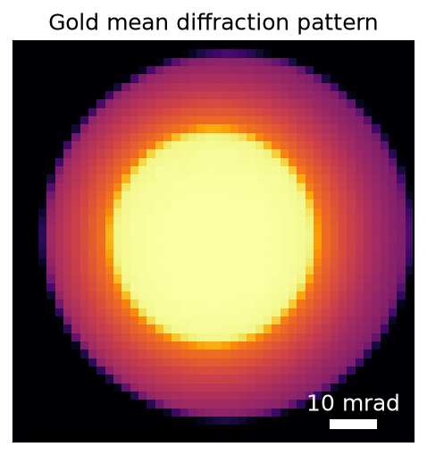
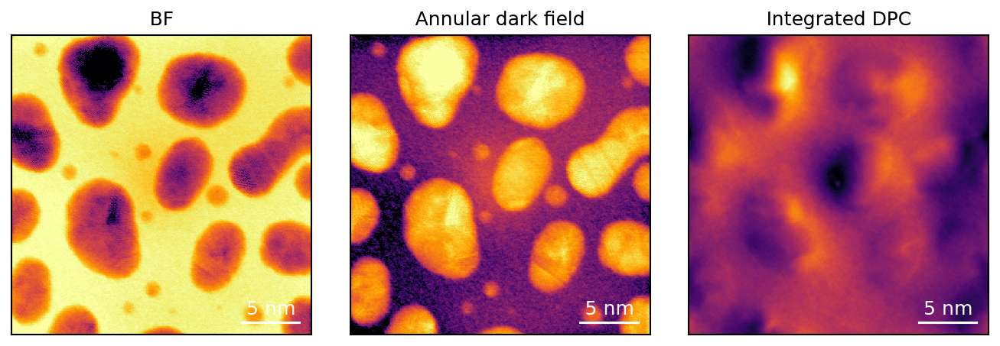
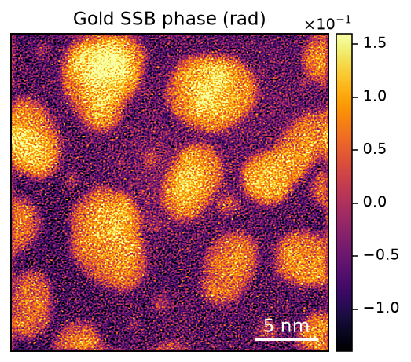

# From acquisition to images

**Load Gold → inspect mean diffraction, BF, ADF and DPC → reconstruct SSB phase.**
Everything needed for a first reconstruction is on this page, using one
acquisition throughout. No QEM conversion is required first.

Follow the [installation guide](install.md) and install `huggingface_hub` for
the download. QuantEM selects the available GPU automatically.
For probe images, fitted coefficients,
search trials, upsampling, and saved results, use the
{ref}`advanced Gold tutorial <gold-advanced>`.

## Get the Gold data

The public [Gold acquisition](https://huggingface.co/datasets/bobleesj/quantem-data/tree/00179851c0015612bfb6e6438e02387f5ffff0ae/4dstem/gold_512_npy_bin4)
contains a **512 × 512 scan and 48 × 48 detector**. Only the detector was binned
by four before upload. The download is about 1.2 GB, is MIT licensed, and stays
in `data/` for reuse.

```python
from pathlib import Path
import json

from huggingface_hub import snapshot_download
from quantem.gpu import io, detector, dpc, SSB
from quantem.core.visualization import show_2d

snapshot_download(
    "bobleesj/quantem-data", repo_type="dataset",
    revision="00179851c0015612bfb6e6438e02387f5ffff0ae",
    allow_patterns="4dstem/gold_512_npy_bin4/*", local_dir="data", token=False,
)
folder = Path("data/4dstem/gold_512_npy_bin4")
metadata = json.loads((folder / "meta.json").read_text())
```

The metadata supplies 300 kV, a 30 mrad convergence semiangle, and
1.84 mrad per detector pixel. Its **0.5 Å scan spacing was inferred from a
sibling acquisition**, not independently calibrated for this file. Scale bars
below retain that qualification.

(mean-diffraction-pattern)=
## Load and view the mean diffraction pattern

```python
data = io.load(folder / "data.npy")
mean_dp = detector.mean(data)
show_2d(
    mean_dp, title="Gold mean diffraction pattern", norm="log_auto",
    cmap="inferno", axsize=(3.5, 3.5),
    scalebar={"sampling": metadata["sampling"][2], "units": "mrad"},
)
```



This averages all scan positions, leaving the 48 × 48 detector image. Inspect
the bright central disk and surrounding scattering before reconstructing.
Logarithmic display contrast makes weak scattering visible. The scale is
angular: detector pixels describe scattering directions, not sample positions.

## View bright field, dark field, and DPC

```python
bf = detector.bf(data)
adf = detector.adf(data)
dpc_result = dpc.run(data)
show_2d(
    [bf, adf, dpc_result.phase], title=["BF", "Annular dark field", "Integrated DPC"],
    norm=["power_sqrt", "power_sqrt", "minmax"], cmap="inferno", axsize=(3, 3),
    scalebar={"sampling": metadata["sampling"][0], "units": "Å"},
)
dpc_result.rotation_deg, dpc_result.use_transpose  # degrees; detector-axis swap flag
```



All three panels show the same 512 × 512 scan. BF integrates the central disk;
ADF is annular dark field, integrating the surrounding ring. The detector
finds the disk automatically. Integrated DPC comes from the measured
center-of-mass shifts. Its displayed contrast is not calibrated in radians.
Each panel uses independent contrast: square-root for BF/ADF and linear for DPC.

DPC estimates the scan–detector rotation. This Gold acquisition reports
`use_transpose=False`, so pass the angle directly to SSB. For other data, check
that value first: a detector-axis swap must be resolved before reusing the
angle alone. SSB does not run DPC automatically.

(reconstruct-phase)=
## Reconstruct SSB phase

Reuse the same acquisition and the DPC rotation above.

```python
ssb = SSB(
    data,
    voltage_kV=metadata["voltage_kV"],  # kV
    semiangle_mrad=metadata["probe_semiangle_mrad"],  # mrad
    scan_sampling_A=metadata["sampling"][0],  # Å per scan pixel
    det_sampling=metadata["sampling"][2],  # mrad per detector pixel
    rotation_angle_deg=dpc_result.rotation_deg,  # degrees
)
aberrations = ssb.find_aberrations()
result = ssb.reconstruct(aberrations, upsample=1)
show_2d(
    result.phase, title="Gold SSB phase (rad)", cmap="inferno", cbar=True,
    scalebar={"sampling": result.scan_sampling_A, "units": "Å"},
)
```

SSB finds the bright-field disk automatically. `find_aberrations()` fits
defocus and twofold astigmatism on the native grid; `reconstruct()` uses those
parameters without repeating the search. Voltage, sampling, and convergence
angle stay fixed. Specimen tilt and model depth spread are zero in this example.



This is the 512 × 512 native reconstruction: 0.5 Å per output pixel and a
25.6 nm square field using the supplied calibration. Experimental Gold has no
known specimen potential here; the image does not establish quantitative phase
accuracy in the thicker particles. **Use 1× for this example:** the current
4× implementation produces stripes. The
{ref}`advanced comparison <gold-upsampling>` shows the same region at both factors.

Data axes are `(scan_rows, scan_cols, detector_rows, detector_cols)`.
To view one measured pattern, use
`show_2d(data[256, 256], norm="power_sqrt", cmap="inferno")`.
The {ref}`advanced disk-geometry example <gold-disk-geometry>` draws the fitted
center and radius on the mean pattern. [I/O](api/io.md) covers detector crops
and 5D acquisition selection; [Detector and DPC](api/images_dpc.md) covers
manual radii and physical-angle units.

## Finish, or inspect further

Keep the session open for the {ref}`advanced tutorial <gold-advanced>`:

| Inspect or save | Example |
|---|---|
| Fitted coefficients and search candidates | {ref}`Read the aberration search <gold-ssb-reconstruction>` |
| Phase beside the model probe | {ref}`Build the probe image <gold-model-probe>` |
| Native versus 4× phase | {ref}`Compare the same field and particle <gold-upsampling>` |
| Measurements and calibration in one file | [Save as QEM](api/qem-python.md) |

When finished, close the session before its acquisition:

```python
ssb.close()
data.close()
```
