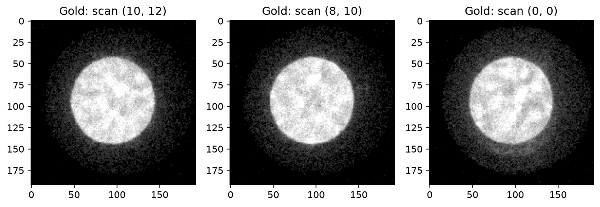
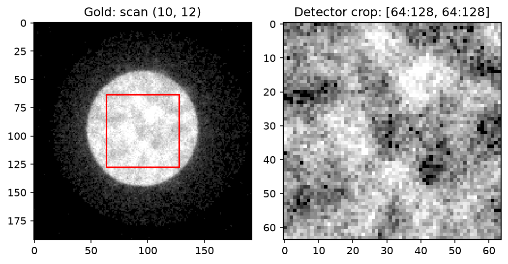

# Select diffraction patterns and regions

How do you retrieve just the measurements you need without expanding an entire
4D-STEM acquisition? Start with one scan position, then select more positions,
and finally choose one acquisition from a series.

The images below use a gold acquisition with a 512 × 512 scan and 192 × 192
detector. Set the filename to your local gold master and keep its companion
HDF5 data files beside it. No dataset is bundled with this tutorial.

Follow the [installation guide](../install.md). The `data.read()` examples
also require a GPU-enabled PyTorch installation for your CUDA or Apple Silicon
machine: this method returns a Torch tensor. `session.frame()` returns NumPy
by default and does not require you to manipulate Torch tensors.

## What do the axes mean?

A 4D acquisition has shape `(scan_rows, scan_columns, detector_rows, detector_columns)`.
Each scan position contains one 2D diffraction pattern.

| Selection | What changes? | What stays the same? |
|---|---|---|
| Scan region | Which specimen positions you read | Pixels within each selected pattern |
| Detector region | Pixels you retain within each pattern | Selected specimen positions |
| Acquisition index | Which tilt, time point, or repeat you read | That acquisition's scan and detector axes |

Indices start at zero. Regions are `(row_start, row_stop, column_start,
column_stop)`; stops are excluded, just like Python slices. These examples
need at least 12 × 16 scan positions and a 128 × 128 detector. Adjust them to
match your acquisition.

## How do I see one diffraction pattern?

```python
from quantem.gpu import detector, io

# Keep this owner open while working through the examples.
data = io.load("gold_master.h5")
session = detector.prepare(data)
print(data.shape)

row, column = 10, 12
index = row * session.scan_shape[1] + column
pattern = session.frame(index)
print(pattern.shape)  # (detector_rows, detector_columns)
```

`frame()` uses a flat, row-major **scan index**, not a detector-pixel index.
The gold source has four detector pixels flagged in its stored mask. Default
loading applies median hot-pixel correction to those pixels before encoding;
the figures show that loaded acquisition. To retain the original measurements,
load with `hot_pixel_correction="none"`.

`frame()` copies only the requested product to NumPy. To keep a supported result on
the accelerator, use `session.frame(index, output="native")`.

For the figures, install `quantem` as well as `quantem.gpu`. Inspect the
pattern with QuantEM’s `show_2d`:

```python
from quantem.core.visualization import show_2d

show_2d(pattern, norm="power_sqrt", title="Gold: scan (10, 12)")
```

## How do I read several patterns?

For a rectangular patch of specimen positions, use a bounded read:

```python
patterns = data.read(scan_region=(8, 12, 10, 16))
print(patterns.shape)  # (4, 6, detector_rows, detector_columns)
first_pattern = patterns[0, 0]  # original scan position (8, 10)
```

This selects 24 patterns, not a 4 × 6 crop within one pattern. The returned
Torch tensor stays on the source GPU. Avoid `data.read()` without a region
unless you intend to allocate the complete decoded acquisition.

For a few unrelated positions, retrieve each explicitly:

```python
positions = [(10, 12), (8, 10), (0, 0)]
selected = [
    session.frame(row * session.scan_shape[1] + column)
    for row, column in positions
]
```

`selected` is a list of three NumPy patterns in the requested order. This is
convenient for inspection; it is not a fused large-batch reader.

```python
show_2d(
    selected,
    norm="power_sqrt",
    title=[f"Gold: scan {position}" for position in positions],
    axsize=(3, 3),
)
```



## How do I read part of a diffraction pattern?

Keep one scan position and specify a detector region as well:

```python
patch = data.read(
    scan_region=(10, 11, 12, 13),
    detector_region=(64, 128, 64, 128),
)[0, 0]
print(patch.shape)  # (64, 64)
```

To apply the same detector crop to several scan positions:

```python
patches = data.read(
    scan_region=(8, 12, 10, 16),
    detector_region=(64, 128, 64, 128),
)
print(patches.shape)  # (4, 6, 64, 64)
```

These operations select pixels; they do not bin, interpolate, or resize them.
The detector crop starts at detector pixel `(64, 64)`, not at the original
origin. Decoding may still require whole frames internally before selecting
the requested detector pixels; a smaller output is not a promise of
proportionally less decoding work.

```python
show_2d(
    [pattern, patch.cpu().numpy()],
    norm="power_sqrt",
    title=["Full detector", "Detector crop: [64:128, 64:128]"],
    axsize=(3.5, 3.5),
)
```



The red box marks the selected region in the saved figure. Crop axes start at
zero locally; add 64 to recover original detector coordinates. Square-root
contrast is for display only, with each panel scaled independently. It does
not change the stored counts. The crop was checked against the corresponding
pixels in the full loaded pattern and matched exactly on CUDA.

```python
data.close()  # after the last read or viewer using this acquisition
```

## How do I choose one acquisition from 5D-STEM?

For a series, the conceptual axes are `(acquisition, scan_row, scan_column,
detector_row, detector_column)`. The first axis might represent tilt or time;
its physical meaning comes from your acquisition metadata.

If each acquisition is a separate file, **load only the one you need**:

```python
paths = ["tilt_00.qem", "tilt_01.qem", "tilt_02.qem"]
with io.load(paths[1]) as acquisition:
    pattern = detector.prepare(acquisition).frame(0)
```

If you need several acquisitions resident together, retain their encoded
owners rather than creating a dense 5D tensor:

```python
series = io.load(paths, stack=False)
try:
    acquisition = series[1]  # second file, preserving paths order
    pattern = detector.prepare(acquisition).frame(0)
    patch = acquisition.read(
        scan_region=(10, 11, 12, 13),
        detector_region=(64, 128, 64, 128),
    )[0, 0]
finally:
    for acquisition in series:
        acquisition.close()
```

`series[1]` chooses an acquisition; `frame(1)` chooses a scan position.
`data.read()` accepts a 4D owner, so select the acquisition first.
Do not treat a list of encoded owners as a dense array with `series[1, ...]`.

For an EMD file containing separate 4D datasets, use the stored dataset path:

```python
with io.load("experiment.emd", dataset_path="experiment/acquisition/data") as data:
    pattern = detector.prepare(data).frame(0)
```

Replace the example path with the dataset's actual HDF5 path. This selects a
named 4D dataset, not an index into an arbitrary 5D array. There is no general
`acquisition_index=` argument for a single on-disk 5D tensor; support depends on
its container layout. See the [I/O contract](../api/io.md) for supported formats.
